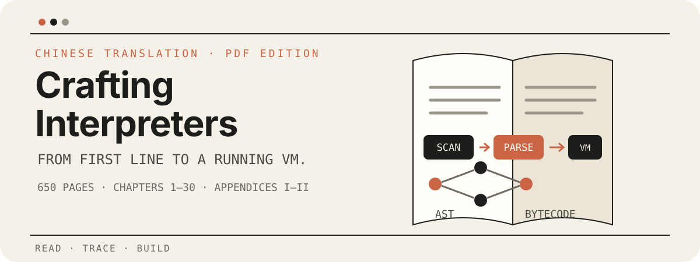

<p align="center">
  
</p>

<p align="center">
  <a href="./Crafting_Interpreters_纯中文版.pdf">下载 650 页 PDF</a>
  ·
  <a href="https://github.com/GuoYaxiang/craftinginterpreters_zh">查看中文翻译仓库</a>
  ·
  <a href="https://craftinginterpreters.com/">阅读英文原书</a>
</p>

# Crafting Interpreters 纯中文版 PDF

给想亲手理解“代码是怎样活起来”的人：这是《Crafting Interpreters》的中文 PDF 排版整理版，适合离线阅读、检索与打印。它从一门小小的 Lox 语言出发，带你走过扫描、解析、求值、编译、字节码与虚拟机的完整旅程。

## 如果你也想知道，代码是怎样活起来的

解释器并不是遥远的黑箱。它可以从一枚 token、一个表达式、一次函数调用开始，被我们一点点拆开，再亲手装回去。

这份仓库把公开中文翻译内容整理成一份更适合长时间阅读的 PDF：让目录、代码、脚注和书签各就其位，把注意力还给那些真正值得琢磨的概念——以及每一个“原来如此”的瞬间。

## 你会走过的路线

```text
Lox 源代码
   │
   ├─ jlox：扫描 → 解析 → 语法树 → 求值
   │
   └─ clox：字节码 → 编译器 → 虚拟机 → 优化
```

这条路线的美妙之处在于：每一步都不是凭空出现的。你会看见一门语言如何从字符变成 token，从 token 组织成语法树，再从解释执行走向编译、字节码与虚拟机。

## PDF 收录内容

- 前言、解释器基础与 Lox 语言介绍
- Tree-Walk Interpreter：第 1–13 章，使用 Java 实现 `jlox`
- Bytecode Virtual Machine：第 14–30 章，使用 C 实现 `clox`
- 附录 I：Lox Grammar
- 附录 II：Generated Syntax Tree Classes
- 共 650 页；正文、代码块、脚注、目录与 PDF Bookmark 已统一排版并完成检查

## 适合这样的你

- 想系统理解解释器、编程语言或编译原理，而不是只记住几个名词
- 想在没有网络的时候继续阅读，或把一段代码、一页脚注带到纸面上慢慢琢磨
- 正在阅读英文原书，希望有一份中文材料作为对照入口
- 喜欢沿着一个能运行起来的项目学习，看着抽象概念逐步变成真实代码

## 从这里开始

如果你准备好了，就从 [下载 PDF](./Crafting_Interpreters_纯中文版.pdf) 开始。从第 1 章开始，慢慢往前走，不必急着一次记住所有概念；让每个可运行的版本，带你比昨天更靠近“解释器到底是怎么工作的”这个答案。

## 来源与致敬

这份 PDF 的起点，来自 [GuoYaxiang/craftinginterpreters_zh](https://github.com/GuoYaxiang/craftinginterpreters_zh) 为中文读者提供的翻译与整理。感谢原作者与贡献者，让这条从 Lox 出发的学习路线有了中文入口；也感谢 Bob Nystrom 写下这本愿意陪读者一步步动手实现的书。

本仓库只负责将公开中文内容整理为 PDF 发行文件，不替代、不冒充原项目，也不是原翻译仓库的官方发布渠道。原翻译仓库 README 标注采用 MIT License；使用、转载或再分发时，请保留原仓库出处，并自行遵守适用的许可证与版权要求。

相关项目：

- 中文翻译仓库：[GuoYaxiang/craftinginterpreters_zh](https://github.com/GuoYaxiang/craftinginterpreters_zh)
- 英文原书：[Crafting Interpreters](https://craftinginterpreters.com/)

## 说明

本仓库只发布 PDF 与阅读所需的说明，不包含原翻译仓库的 Markdown 源文件。如果你发现排版问题，欢迎在本仓库提出反馈；如果是翻译内容问题，建议回到原翻译仓库反馈。

<p align="center">
  <a href="https://github.com/openai/codex">
    
  </a>
</p>
